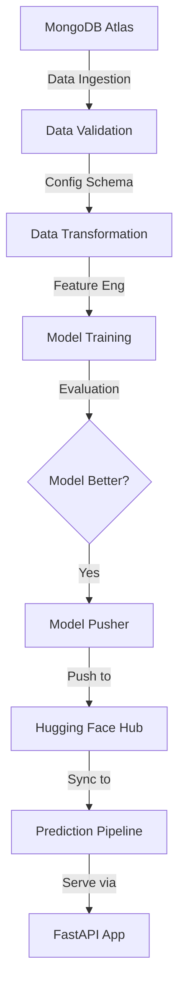

# 🚗 Vehicle Insurance Prediction: End-to-End MLOps Pipeline

[](https://www.python.org/)
[](https://fastapi.tiangolo.com/)
[](https://huggingface.co/)
[](https://www.mongodb.com/atlas)
[](https://www.docker.com/)

An enterprise-grade MLOps project demonstrating a robust data pipeline for vehicle insurance prediction. This project showcases the complete lifecycle of a machine learning model, from data ingestion and validation to model deployment using modern cloud infrastructure and CI/CD practices.

---

## 🌟 Project Highlights

- **Modular Architecture**: Clean, scalable code structure following industrial best practices.
- **Robust Pipeline**: Automated Data Ingestion, Validation, Transformation, and Model Training.
- **Model Management**: Integrated with **Hugging Face Hub** for model versioning and artifact storage.
- **Cloud Native**: Deployed using **Docker** and suitable for **Hugging Face Spaces** or **AWS EC2**.
- **Modern UI**: Sleek **FastAPI** web interface with **Glassmorphism** design for a premium user experience.

---

## 🏗️ Architecture & Workflow

The system is designed as a sequence of modular components managed by a central orchestration pipeline.



---

## 🛠️ Tech Stack

- **Backend**: FastAPI (Python 3.11)
- **Database**: MongoDB Atlas (Cloud NoSQL)
- **Model Storage**: Hugging Face Hub (Model Pusher & Registry)
- **Containerization**: Docker
- **Deployment**: Hugging Face Spaces / AWS
- **CI/CD**: GitHub Actions
- **Logging & Monitoring**: Custom Logging and Exception Modules

---

## 📂 Project Structure

```text
├── .github/workflows    # CI/CD pipelines
├── config               # Configuration files (schema, model params)
├── notebook             # EDA and experimentation notebooks
├── src                  # Core source code
│   ├── components       # Pipeline components (Ingestion, Trainer, etc.)
│   ├── configuration    # DB and Cloud connections
│   ├── constants        # Project constants
│   ├── entity           # Data classes for config and artifacts
│   ├── pipeline         # Training and Prediction pipelines
│   └── utils            # Helper functions
├── static               # UI assets (CSS, JS)
├── templates            # HTML templates (Jinja2)
├── Dockerfile           # Deployment container config
└── app.py               # Main API application
```

---

## 🚀 Getting Started

### 1. Prerequisites
- Python 3.10 or 3.11
- MongoDB Atlas Account
- Hugging Face Token (Write Access)

### 2. Installation
```bash
# Clone the repository
git clone https://github.com/lakshya-hidau/MLOps-Learning/Project_01_Vehicle_Insurance_Data.git
cd Project_01_Vehicle_Insurance_Data

# Create virtual environment
conda create -n vehicle python=3.10 -y
conda activate vehicle

# Install dependencies
pip install -r requirements.txt
```

### 3. Environment Setup
Create a `.env` file in the root directory:
```bash
MONGODB_URL="your_mongodb_connection_string"
HF_TOKEN="your_huggingface_write_token"
REPO_ID="your-username/your-repo-name"
```

### 4. Running the Application
```bash
# Start the FastAPI server
python app.py
```
Access the app at `http://localhost:8080` (or as configured in `constants`).

---

## 🔄 CI/CD & Deployment

### GitHub Actions
The project includes a GitHub Actions workflow that automates the following on every push:
1. **Linting & Testing**: Ensures code quality.
2. **Docker Build**: Creates a fresh container image.
3. **Continuous Deployment**: Pushes the image to **Hugging Face Spaces** or **AWS ECR** for production.

### Docker Deployment
```bash
# Build the image
docker build -t vehicle-insurance-app .

# Run the container
docker run -p 7860:7860 -e MONGODB_URL="your_url" vehicle-insurance-app
```

---

## 📈 Component Breakdown

| Component | Responsibility |
| :--- | :--- |
| **Data Ingestion** | Fetches raw data from MongoDB and performs train-test split. |
| **Data Validation** | Checks schema consistency and drifts using `config/schema.yaml`. |
| **Data Transformation** | Applies feature engineering and scaling using Scikit-Learn pipelines. |
| **Model Trainer** | Trains various models (currently configured for classification) and evaluates performance. |
| **Model Evaluation** | Compares current model with the production model in Hugging Face Hub. |
| **Model Pusher** | Uploads the best-performing model to the **Hugging Face Hub**. |

---

## 🤝 Connect

Special thanks to all contributors and the MLOps community for the inspiration!

- **LinkedIn**: https://www.linkedin.com/in/lakshya-hidau
- **Email**: lakshyahidau2005@gmail.com

---

*Made with ❤️ for the MLOps Community*
