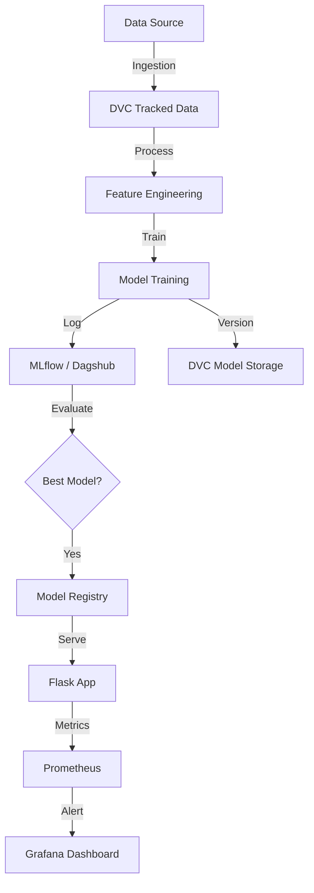

# 🏆 Capstone: Advanced Sentiment Analysis MLOps Pipeline

[](https://www.python.org/)
[](https://flask.palletsprojects.com/)
[](https://mlflow.org/)
[](https://dvc.org/)
[](https://www.docker.com/)

A production-grade MLOps capstone project featuring a fully automated Sentiment Analysis pipeline. This project demonstrates advanced practices in experiment tracking, data versioning, automated CI/CD, and real-time monitoring.

---

## 🌟 Project Highlights

- **Experiment Tracking**: Seamlessly logging parameters, metrics, and models using **MLflow** and **Dagshub**.
- **Data & Pipeline Versioning**: Full reproducibility using **DVC** for data, models, and execution stages.
- **Automated CI/CD**: End-to-end automation via **GitHub Actions** for testing, building, and artifact delivery.
- **Real-time Monitoring**: Integrated with **Prometheus** and **Grafana** for health and performance observability.
- **Model Registry**: Systematic lifecycle management (Staging/Production) via MLflow Model Registry.

---

## 🏗️ Architecture & Workflow

The pipeline is orchestrated using DVC, ensuring every stage from ingestion to appraisal is tracked and reproducible.



---

## 🛠️ Tech Stack

- **Backend**: Flask (Python 3.10)
- **Orchestration**: DVC (Data Version Control)
- **Experiment Tracking**: MLflow & Dagshub
- **Containerization**: Docker
- **Monitoring**: Prometheus & Grafana Cloud
- **CI/CD**: GitHub Actions
- **Libraries**: Scikit-Learn, XGBoost, NLTK, Pandas

---

## 📂 Project Structure

```text
├── .github/workflows    # CI/CD pipeline definitions
├── .dvc                 # DVC configuration
├── data                 # Versioned data (managed by DVC)
├── flask_app            # Flask web application & Dockerfile
├── local_storage        # Local DVC remote (for dev)
├── logs                 # Application & Training logs
├── mlruns               # Local MLflow tracking data
├── models               # Versioned models (managed by DVC)
├── src                  # Core source code
│   ├── components       # Pipeline stages (Ingestion, Trainer, etc.)
│   ├── pipeline         # Training & Prediction pipelines
│   └── utils            # Common utilities
├── dvc.yaml             # DVC pipeline definition
├── params.yaml          # Hyperparameters & settings
└── requirements.txt     # Project dependencies
```

---

## 🚀 Getting Started

### 1. Prerequisites
- Python 3.10 or 3.11
- Docker Desktop
- Dagshub Account (for remote MLflow tracking)

### 2. Installation
```bash
# Clone the repository
git clone https://github.com/lakshya-hidau/MLOps-Learning.git
cd Project_02_Capstone

# Create virtual environment
python -m venv .venv
source .venv/bin/activate  # Windows: .venv\Scripts\activate

# Install dependencies
pip install -r requirements.txt
```

### 3. Environment Setup
Create a `.env` file in the root directory:
```bash
MLFLOW_TRACKING_URI="your_dagshub_uri"
MLFLOW_TRACKING_USERNAME="your_username"
MLFLOW_TRACKING_PASSWORD="your_password"
CAPSTONE_TEST="your_test_key"
```

### 4. Running the Pipeline & App
```bash
# Execute the DVC pipeline
dvc repro

# Start the Flask server
cd flask_app
python app.py
```
Access the app at `http://localhost:5000`.

---

## 🔄 CI/CD & Deployment

### GitHub Actions
The project includes a robust CI/CD workflow that triggers on every push:
1. **Validation**: Runs unit tests for the model and application.
2. **DVC Repro**: Ensures the pipeline is reproducible in the CI environment.
3. **Docker Delivery**: Builds and pushes the latest image to **DockerHub**.

---

## 📈 Component Breakdown

| Component | Responsibility |
| :--- | :--- |
| **Data Ingestion** | Fetches and prepares raw sentiment datasets. |
| **Data Transformation** | Handles text cleaning, tokenization, and vectorization. |
| **Model Trainer** | Trains sentiment classifiers and logs to MLflow. |
| **Model Evaluation** | Validates model metrics against predefined thresholds. |
| **Monitoring** | Exposes `/metrics` endpoint for Prometheus scraping. |

---

## 🤝 Connect

- **LinkedIn**: https://www.linkedin.com/in/lakshya-hidau
- **Email**: lakshyahidau2005@gmail.com

---

*Made with ❤️ for the MLOps Community*
